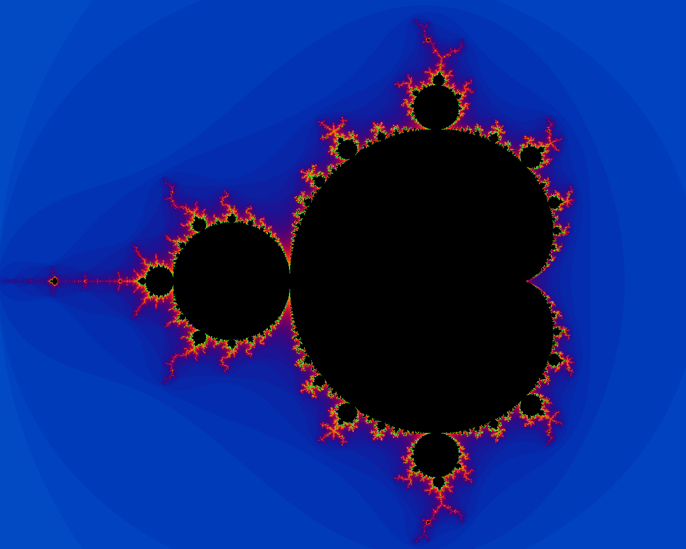

### Mandelbrot Set Renderer with OpenGL

A tutorial project created to learn OpenGL and fractals.

###### What does it look like?



###### Compilation

To compile the project, install GLEW and GLFW development libraries.

**Build:**

```sh
make
```

**Run:**
```sh
./app
```

Good luck!
